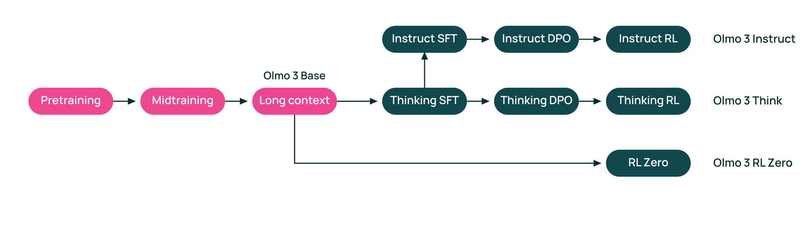

# OLMo 3 Model Flow Overview

OLMo 3 is a fully open-source model family with public data and code. This overview uses its **model flow** as an end-to-end example to show how **data curation** and **evaluation** are woven into each training stage.

## The end-to-end flow at a glance

**Base model training (7B and 32B):**

1. **Pretraining** on large-scale, mostly natural data.
2. **Midtraining** on targeted data to move specific capabilities.
3. **Long-context extension** to train on long documents and tasks.

Each stage uses task-specific evaluations to decide what data to add, what to filter, and which mixtures are worth scaling.

**Post-training:**

After the base model, OLMo 3 applies a shared pipeline—**SFT → DPO → RL**—and branches into three model variants:

- **OLMo 3 Instruct:** non-reasoning assistants optimized for chat, instruction following, and tool use.
- **OLMo 3 Think:** reasoning models trained to produce explicit thinking traces before answers.
- **OLMo 3 RL-Zero:** reasoning models trained via RL directly from the base model.

Although Instruct and Think use similar algorithms, their **data curation** and **evaluation targets** differ. The sections that follow unpack each stage of the flow and highlight how those choices shape model behavior.
